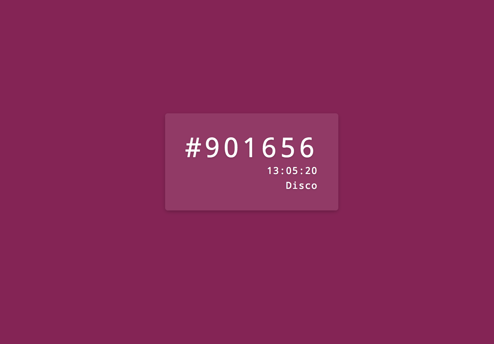

# Hex_Clock

A simple hexidecimal clock build with Vue Js that displays colors based on its value. Modifiers were added to allow it to cover more of the color spectrum. The text in the center is also changed dynamically based on how dark the current color and background are. 

The color names are provided by NTC Js.
Thank You! :)
